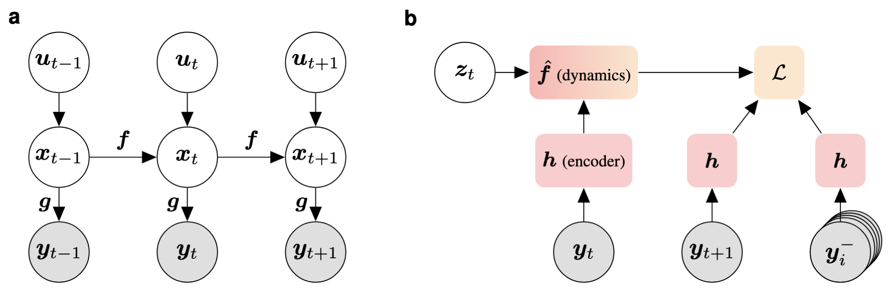
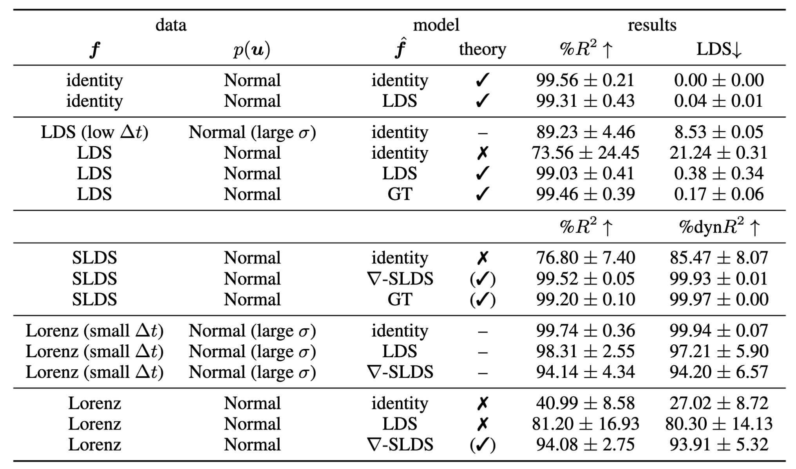
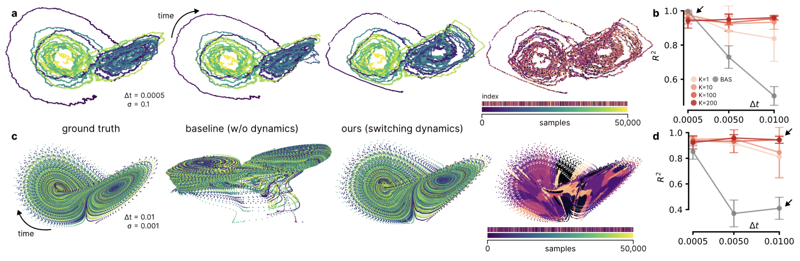

# Self-supervised contrastive learning performs non-linear system identification

[[website](https://dynamical-inference.ai/dyncl)] [[pre-print](https://arxiv.org/abs/2410.14673)]

This repo contains the code for the `DynCL` algorithm presented in "Self-supervised contrastive learning performs non-linear system identification".

**We will open source the code upon publication of our pre-print**. Stay tuned!
If you want to get notified about the code release, make sure to `watch 🕶️` the repo!
In case you need early access to the codebase (for benchmarking/comparisons, application of DynCL to a dataset, etc.), please send an email to [Steffen Schneider](mailto:steffen.schneider@helmholtz-munich.de).

## Summary

Self-supervised learning (SSL) approaches have brought tremendous success across many tasks and domains. It has been argued that these successes can be attributed to a link between SSL and identifiable representation learning: Temporal structure and auxiliary variables ensure that latent representations are related to the true underlying generative factors of the data. Here, we deepen this connection and show that SSL can perform system identification in latent space. We propose a new model to uncover linear, switching linear and non-linear dynamics under a non-linear observation model, give theoretical guarantees and validate them empirically.

### Generative process and model

<p>(a) The assumed data-generating process: <i>y</i> represents the observable input variables, <i>x</i> denotes the latent variables, and <i>u</i> is the control input. (b) General formulation of our method: It consists of an encoder <i>h</i> that is shared across the reference, positive, and negative samples. The method also includes a dynamics model <i>f̂</i>. Additionally, a (possibly latent) variable <i>z</i> can be used to parameterize the dynamics model (see section 4).</p>



### Theory and empirical validation 

<p>Comprehensive categorization of ground-truth dynamical processes <i>f</i> and model configurations <i>f̂</i>. Note, the mixing function <i>g</i> is always assumed non-linear, and <i>h</i> is always parameterized as a neural network. For all metrics, we report mean and standard deviation across 3 datasets (5 for Lorenz) and 3 experiment repeats.</p>



### Non-linear system identification

<p>Contrastive learning of 3D non-linear dynamics following a Lorenz attractor model. (a) Left to right: ground truth dynamics for 10k samples with <i>dt = 0.0005</i> and <i>σ = 0.1</i>, estimation results for baseline (identity dynamics), DynCL with ∇-SLDS, estimated mode sequence. (b) Empirical identifiability (<i>R²</i>) between baseline (BAS) and ∇-SLDS for varying numbers of discrete states <i>K</i>. (c, d) Same layout but for <i>dt = 0.01</i> and <i>σ = 0.001</i>.</p>



## Reference

```
@article{gozalezlaizschmidt2024dyncl,
  author = {González Laiz, Rodrigo and Schmidt, Tobias and Schneider, Steffen},
  title={Self-supervised contrastive learning performs non-linear system identification},
  journal={arxiv},
  year={2024},
  month={October},
  url={https://arxiv.org/abs/2410.14673}
}
```
